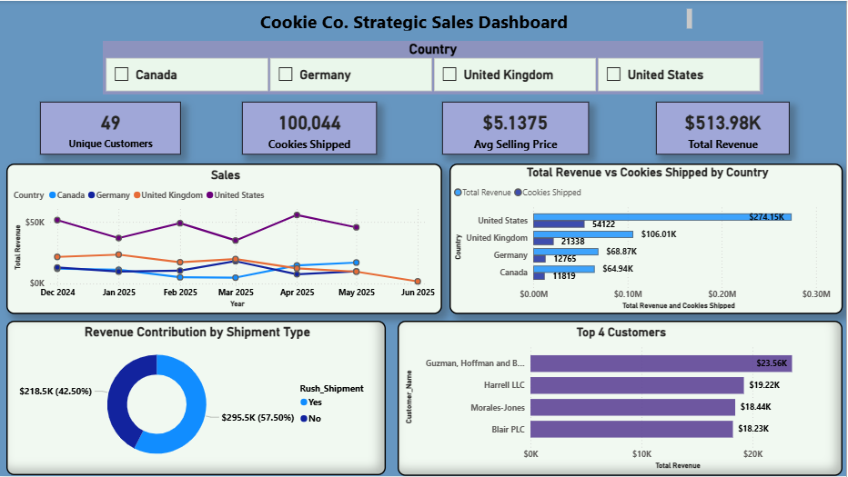

# Cookie Company Sales Analysis

## Project Overview
This is a comprehensive data analysis and business intelligence project completed for the **Advanced Digital Literacy Center (ADLC) Technical Interview**. The analysis focuses on strategic sales insights for Cookie Co., utilizing statistical analysis, data visualization, and business recommendations.

---

## 📊 Dashboard Overview

The dashboard above provides a comprehensive visual analysis of Cookie Company's sales performance, including:
- Revenue trends across different countries
- Rush shipment distribution analysis
- Average revenue by country comparison
- Order distribution by shipping method

---

## 🎯 Actionable Insights for Strategic Sales for Cookie Co.

### 1. Market Strategy

**The Goal:** Determine which country to target for the next campaign.

**The Data:** While Germany had the highest Average Order Value ($2,649.00), the ANOVA test (p=0.9783) proves that there is no statistically significant difference in spending behavior between countries.

**Country to Target: United States**

**Why:** Since revenue per order is statistically the same everywhere, the company should target the market with the highest Volume Potential. The United States (US) already accounts for 53% of the cookie orders (106/200) and 54% of the company's total revenue ($274,148.75).

**Strategy:** Not to focus on "premium" markets like Germany, and instead, double down on the US to leverage existing brand relationships and scale volume.

---

### 2. Rush Shipment Analysis: Continue or Discontinue?

**The Goal:** Evaluate the revenue contribution of Rush vs. Regular shipping.

**The Data:** "Yes" for Rush yields a mean revenue of $2,662 vs. $2,454 for "No." However, the T-test (p=0.31) shows this difference is not significant.

**Verdict:** Continue offering Rush Shipments, but change the pricing model.

**Why:** Probably the company currently is treating Rush as a "service" rather than a "product." Since customers aren't naturally spending significantly more on Rush orders, the company is likely losing profit margin due to higher labor and logistics costs associated with speed.

**Strategy:** Implement a mandatory "Rush Processing Fee" (e.g., $15 - $25 per order). Since there is no inherent "premium" in order size for Rush, the fee ensures the service becomes a profit center rather than a logistical burden.

---

### 3. Inventory & Seasonality Analysis

**The Goal:** Set optimal inventory levels based on demand peaks.

**The Data:** Looking at the "Monthly Revenue Trend" graph (attached in the dashboard), there is an irregular trend characterized by massive spikes and sharp declines across all the countries.

**Strategy:** Since 55% of the company's orders are "Rush," the company must maintain a "Safety Stock" level of at least 15% of monthly volume at all times to avoid stock-outs during unexpected urgent requests.

---

## 📁 Project Files

| File | Description |
|------|-------------|
| `Cookie_Company_Analysis.ipynb` | Jupyter Notebook containing the complete data analysis, statistical tests, and visualizations |
| `Cleaned_Cookie_Data.csv` | Cleaned dataset used for analysis |
| `Cookie_Company_Data.xlsx` | Original data in Excel format |
| `Actionable Insights Report.pdf` | Detailed business report with strategic recommendations |
| `Dashboard.PNG` | Visual dashboard screenshot showing key performance metrics |
| `Data Analysis Plan.pdf` | Initial analysis plan and methodology |
| `Cookie_data_dashboard.pbix` | Power BI dashboard file (interactive version) |

### Visualization Files
- `average_revenue_by_country.png` - Country comparison analysis
- `average_revenue_rush_shipment.png` - Rush shipment impact analysis
- `country_distribution.png` - Geographic distribution of orders
- `rush_shipment_distribution.png` - Rush vs. regular shipment distribution

---

## 📈 Key Performance Metrics

- **Total Revenue:** $274,148.75 (US market represents 54%)
- **Total Orders Analyzed:** 200
- **US Market Share:** 53% of orders (106/200)
- **Rush Orders:** 55% of all orders
- **Average Order Value (Germany):** $2,649.00
- **Average Order Value (Rush):** $2,662.00
- **Average Order Value (Regular):** $2,454.00

---

## 🔬 Statistical Analysis Conducted

1. **ANOVA Test:** p-value = 0.9783 (no significant difference in spending by country)
2. **T-Test (Rush vs. Regular):** p-value = 0.31 (no significant difference in order value)
3. **Descriptive Statistics:** Mean, Median, Standard Deviation by country and shipping method
4. **Revenue Trend Analysis:** Monthly trends across all markets

---

## 💡 Key Recommendations Summary

1. **Focus on Volume Growth in the US** - Leverage the existing market dominance rather than expanding to premium markets
2. **Monetize Rush Shipments** - Implement processing fees to convert a cost center into a profit center
3. **Optimize Inventory Management** - Maintain safety stock of 15% monthly volume to handle rush demand fluctuations

---

## 🛠️ Technical Stack

- **Data Analysis:** Python (Pandas, NumPy, SciPy)
- **Visualization:** Matplotlib, Seaborn, Power BI
- **Statistical Tools:** ANOVA, T-Tests, Descriptive Statistics
- **Data Format:** CSV, Excel, Jupyter Notebook

---

## 📝 Conclusion

This analysis demonstrates a data-driven approach to strategic decision-making for Cookie Co. By leveraging statistical analysis and market insights, the company can optimize its geographic focus, improve service profitability, and enhance inventory management to maximize revenue and operational efficiency.

---

**Last Updated:** April 2026  
**Submitted for:** Advanced Digital Literacy Center (ADLC) Technical Interview
